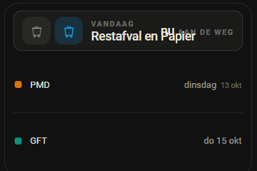
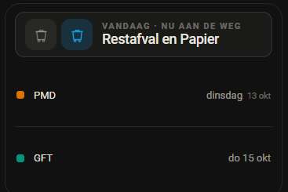
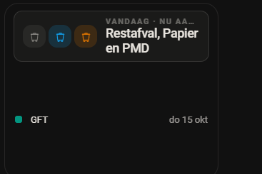

# 0.57.1 — Twee bakken op een telefoon staan niet meer door elkaar

## De melding

7 oktober 2026, met een schermafdruk van zijn telefoon (pop-up met de
afvalkaart):

> *"op mobiel niet helemaal lekker als er meerdere afvaltypes zijn staat door
> elkaar"*

Op de schermafdruk loopt "Restafval en Papier" dwars door "nu aan de weg" heen.

## Nagebootst en gemeten

Zijn kaart uit Overview (alleen gelezen): `domotiapp-waste-card`, vier sensoren
van Mijnafvalwijzer, `bare: true`. Zijn sensoren van die dag nagebootst
(Restafval en Papier op 07-10-2026, PMD op 13-10, GFT op 15-10) en de kaart met
de echte `hass` met de hand in een vak van **354 pixels** gehangen. Dat is de
breedte die uit zijn schermafdruk volgt bij een telefoon van 393 pixels: het
vlak beslaat 84% van de beeldbreedte. Niet het browservenster verkleind
(valkuil 40).

Op de code van vóór deze ronde (0.57.0):

```
vlak                x 313..641   (328 breed)
"Restafval en Papier"  tekst x 424..573,1
"nu aan de weg"        x 523,6..628
overlap             49,5 px
```



## De oorzaak

Het vlak is een flexrij: bakken, de namen, en rechts de telling ("nu aan de
weg", "6 dagen"). Op de namen stond wel `overflow: hidden` en een ellips, maar
op een `<span>`, en een inline element kapt niets af. Het vak van de namen kromp
netjes tot wat er over was (87,6 px), en de tekst liep er gewoon overheen.

Sinds 0.54.1 staan er op één dag meer bakken in het vlak ("Restafval en
Papier", twee iconen van 40 px), en dan blijft er op een telefoon voor de namen
geen ruimte meer over. Met één bak was dat er wel, en is het nooit opgevallen.

## Wat er veranderd is

1. **De namen kappen echt af** (`display: block`). Dat is de ondergrens: nooit
   meer door elkaar.
2. **Past de naam niet naast de telling, dan verhuist die naar de regel
   erboven**: "VANDAAG · NU AAN DE WEG", en de namen krijgen de hele breedte.
   Dat wordt GEMETEN (`pasHeroAan_`), niet geschat: of het past hangt van de
   namen af, niet alleen van de breedte. Gemeten in de gewone vorm, dus een
   kaart die breder wordt gaat vanzelf terug.
3. **Een waarnemer meet opnieuw als het vlak van maat verandert.** In een
   pop-up wordt de kaart getekend terwijl hij dicht is (dan is er niets te
   meten, valkuil 52) en komt er bij het openen geen nieuwe `hass` langs.
4. **Is het daarna nog te smal** (drie bakken op een smalle telefoon), dan
   mogen de namen over twee regels.

Wat er bovenaan bij komt staat in `heroWoorden` in `afval-logica.js`:
vandaag "nu aan de weg", morgen en overmorgen niets (dat zegt de regel zelf
al), daarna "over 6 dagen". Daar staan ook de woorden die rechts staan, die
eerst in `paint()` stonden.

## Bewijs

### De nieuwe toetsen falen op de oude code

`tests/js/afval-hero-woorden.test.mjs` tegen `afval-logica.js` van vóór deze
ronde:

```
  ✖ vandaag: nu aan de weg (1.1082ms)
  ✖ morgen: 1 dag, enkelvoud (0.1212ms)
  ✖ later: het aantal dagen (0.1131ms)
  ✖ vandaag is het nieuws: nu aan de weg (0.1537ms)
  ✖ morgen en overmorgen zegt de regel zelf al (0.0991ms)
  ✖ daarna: over hoeveel dagen, want er staat alleen een dag (0.0917ms)
ℹ pass 0
ℹ fail 6
  TypeError: A.heroWoorden is not a function
```

| Toets | Soort |
|---|---|
| de woorden rechts (nu aan de weg, 1 dag, 6 dagen) | **REGRESSIEWACHT**: dezelfde woorden als vóór deze ronde; ze vallen op de oude code alleen om omdat de functie nieuw is |
| wat er bovenaan bij komt (3x) | **NIEUW GEDRAG** |

De opmaak zelf is geen unittest (geen jsdom, zie CLAUDE.md); die is hieronder in
de browser gemeten.

### Verse code

```
?v= in performance.getEntriesByType("resource"):  06ea1ad569ee
sha256 van de bundel op schijf:                   06ea1ad569ee...
customElements.get("domotiapp-waste-card").prototype.pasHeroAan_:  function
```

(Dat was de bouw vóór het verhogen van het versienummer naar 0.57.1.)

### Gemeten in Chrome, in hetzelfde vak van 354 px

Het testtabblad stond verborgen (hij werkte in een ander Chrome-venster; niet
naar voren gehaald, valkuil 60). In een verborgen tabblad tekent Chrome niet,
en dan vuurt ook een ResizeObserver niet. Een schermafdruk dwingt wél een
getekend beeld af, en daarmee is de waarnemer gemeten: zonder handmatige
meting en zonder nieuwe `hass`.

**Zoals in een pop-up.** De kaart opgehangen in een vak met `display: none`,
daarna het vak getoond:

```
krap terwijl dicht:              false   (niets te meten)
krap meteen na het openen:       false   (nog geen beeld getekend)
krap na het eerste beeld:        true
zichtbaar bovenaan:              "VANDAAG · NU AAN DE WEG"
rechts:                          verborgen
"Restafval en Papier":           tekst x 424..573,1, vak tot 628, vlak tot 641
ruimte rechts van de namen:      67,9 px
vlak:                            58 px hoog (ongewijzigd)
```



**Alle gevallen** (`krap`, wat er zichtbaar staat, en de maten):

| Vak | Bakken | krap | Bovenaan | Rechts | Namen | Vlak | Kaart |
|---|---|---|---|---|---|---|---|
| 354 | Restafval en Papier | ja | VANDAAG · NU AAN DE WEG | - | 1 regel, 67,9 px over | 58 | 248 |
| 385 | idem | ja | idem | - | 1 regel, 98,9 px over | 58 | 248 |
| 520 | idem | nee | VANDAAG | nu AAN DE WEG | 1 regel, 116,5 px tot de telling | 58 | 248 |
| 354 | Restafval, Papier en PMD | ja | VANDAAG · NU AAN DE WEG | - | 2 regels, niets afgekapt | 72,4 | 248 |
| 300 | idem | ja | VANDAAG · NU AA… | - | 2 regels, niets afgekapt | 72,4 | 248 |
| 354 | alleen PMD | nee | VANDAAG | nu AAN DE WEG | 1 regel | 58 | 248 |
| 354 → 520 | Restafval en Papier | ja → nee | terug naar VANDAAG | terug | 1 regel | 58 | 248 |



De kaart blijft in elk geval 248 px (vier rasterrijen); de onderste lijstregel
eindigt 11 px boven de onderkant van de kaart.

### Tellingen

- JS: 1348 toetsen, alle groen.
- Python: 773 toetsen, alle groen (lokaal in Docker; geen Python
  gewijzigd behalve het versienummer).
- `verify`, `check:registratie`, `check:controls`, `check:css`: OK.
- Bundel 899.985 bytes.

## Samenvatting

Op een telefoon liepen twee bakken op één dag ("Restafval en Papier") dwars
door "nu aan de weg" heen: de ellips stond op een element dat niet kan
afkappen. Nu kappen de namen echt af, en als ze niet passen verhuist de
telling naar de regel erboven ("VANDAAG · NU AAN DE WEG"). Dat wordt gemeten,
ook als een pop-up opengaat. Met één bak, of op een brede kaart, verandert er
niets.

## Wat niet lukte

- Niet op zijn telefoon gemeten; de breedte (354 px) is uit zijn schermafdruk
  afgeleid. Een iPhone Pro Max geeft ongeveer 385 px; ook gemeten.
- De waarnemer in een ZICHTBAAR tabblad niet gezien: het tabblad stond
  verborgen, en de schermafdruk heeft het tekenen afgedwongen. In een
  zichtbaar tabblad, en in de app op een telefoon, tekent de browser vanzelf.
- In een vak van 300 px met drie bakken krijgt de bovenregel een ellips
  ("NU AA…"). Dat is smaller dan zijn telefoon.

## Aannames

- Dat de telling bovenaan beter is dan de namen afkappen. Afkappen
  verstopt precies de tweede bak, en dat was het hele punt van 0.54.1.
- Dat "morgen" en "overmorgen" bovenaan niets extra nodig hebben: "MORGEN ·
  1 DAG" zegt twee keer hetzelfde.
- Dat het infoscherm dit niet heeft: dat staat beeldvullend op een iPad, en
  heeft een eigen opmaak. Niet nagemeten.

## git status --porcelain

Vlak voor de commit:

```
 M custom_components/domotiapp_lovelace/frontend/domotiapp-lovelace.js
 M custom_components/domotiapp_lovelace/manifest.json
 M src/cards/afval-logica.js
 M src/cards/waste-card.js
?? docs/afval-op-de-telefoon/
?? tests/js/afval-hero-woorden.test.mjs
```
