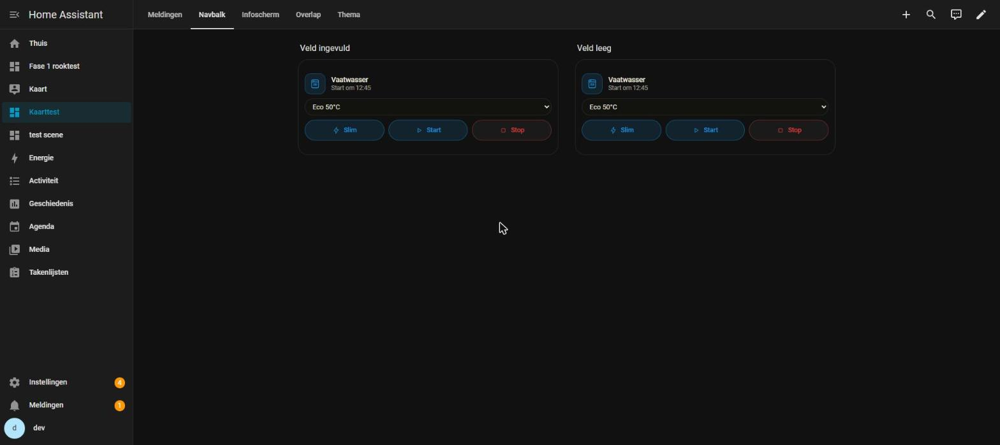

# 0.55.1 — De vaatwasserkaart leest de geplande start van de coach weer

## De melding

7 oktober 2026:

> *"bij de vaatwasser kaart in de GUI editor heb ik de geplande start van de
> coach neergezet bij mij thuis maar de vaatwasser kaart laat dat niet zien, De
> status klopt wel als ik de status check"*

## Wat er in zijn Home Assistant stond

Alleen gelezen, over de websocket (`get_states`, `lovelace/dashboards/list`,
`lovelace/config`, `config_entries/get`). Geen dienst aangeroepen, niets
weggeschreven.

De vaatwasserkaart staat op Overview en op de wandtablet, op allebei met
dezelfde config, en het veld is goed ingevuld:

```
planned_start: sensor.domotiapp_coach_vaatwasser_start_om
smart:         input_boolean.schakelaar_vaatwasser
status:        sensor.vaatwasser_bedrijfsstatus  ->  'ready'
```

En de sensor van de coach:

```
toestand:  'om 12:15'
start:     '2026-10-07T12:15:00+02:00'
rule:      'wait-for-start'
released:  true
running:   false
release_switch: 'input_boolean.schakelaar_vaatwasser'
```

Zijn eigen vaststelling klopt dus: de coach heeft een plan, de sensor zegt het,
de kaart is goed ingesteld. De fout zit in de kaart.

## De oorzaak

De kaart is op 26 september 2026 (0.47.0) gebouwd tegen coach v0.100.0. Daar
was de TOESTAND van de sensor zelf het tijdstip (`device_class: timestamp`).
Dezelfde avond vroeg hij de coach om een tijd in woorden in plaats van Home
Assistants "over 2 uur", en sinds coach v0.100.1 is de toestand tekst:

| Toestand | Attribuut `start` |
|---|---|
| `om 14:00` | het tijdstip, met tijdzone |
| `morgen om 09:00` | idem |
| `zondag om 09:00` | idem |
| `nu` | `null` (de coach start hem op dit moment) |
| `unknown` | `null` (niet vrijgegeven, of hij draait al) |

Zie de kop van `sensor.py` in de coach. `startMoment` in
`src/cards/vaatwasser-logica.js` las alleen de toestand, en alleen als tijdstip
of als kale klok ("14:00"). "om 12:15" is geen van beide, dus er was geen plan,
en de kaart viel terug op "Klaar om te starten". Zonder fout of melding.

Dat dit niet eerder opviel: de kaart en de coach zijn in twee sessies
gebouwd, op dezelfde avond, en de kaart is gemeten tegen een nagebootste sensor
in de vorm van v0.100.0.

## Wat er veranderd is

`startMoment` kijkt nu in deze volgorde:

1. **het attribuut `start`**: daar staat het tijdstip van de coach. De
   toestand hoeft de kaart dan niet te ontleden, en de woorden maakt de kaart
   zelf (zodat ze op elke kaart hetzelfde zijn);
2. **"nu"**: dan is het moment nu, en zegt de kaart **"Start nu"**;
3. **de toestand zelf**, zoals eerst: een tijdstip (coach v0.100.0, een
   `datetime`, een `input_datetime`) of een kale klok.

Een toestand `unknown` of `unavailable` wint nog steeds van alles: dan is er
niets gepland, wat er ook in de attributen staat.

Daarbij één kleine verandering in de woorden: in de minuut marge NA het
geplande moment (de tekst blijft dan staan tot de machine "draait" meldt) zei
de kaart "Start om 12:15" terwijl het al 12:15:30 was. Dat is nu ook
"Start nu".

Geen wijziging in de editor, de rangorde of de serverkant.

## Bewijs

### De nieuwe toetsen falen op de oude code

`tests/js/vaatwasser-start.test.mjs` tegen `vaatwasser-logica.js` van vóór de
reparatie:

```
  ✖ leest het tijdstip uit het attribuut start (0.7855ms)
  ✖ ook als het morgen of over een paar dagen is (0.2481ms)
  ✔ REGRESSIEWACHT: laat een tijdstip in start dat voorbij is vallen, net als in de toestand (0.1293ms)
  ✖ 'nu' is nu, en dan zegt de kaart dat ook (0.1978ms)
  ✖ zet het plan op de kaart in plaats van klaar om te starten (0.8778ms)
  ✔ REGRESSIEWACHT: niets gepland is niets, ook met de attributen erbij (0.0998ms)
✖ NIEUW GEDRAG: de coach zet tekst in de toestand en het tijdstip in start (2.6213ms)
  ✖ zegt nu als het moment er is (0.1997ms)

✖ leest het tijdstip uit het attribuut start (0.7855ms)
  AssertionError [ERR_ASSERTION]: Expected values to be strictly equal:
  + actual - expected

  + 0
  - 1791368100000
```

(`+null` is 0: de oude code vond geen moment.) Op de nieuwe code: 59 van 59
groen in de twee vaatwasserbestanden. De eerste toets gebruikt zijn sensor van
vanochtend letterlijk.

| Toets | Soort |
|---|---|
| leest het tijdstip uit het attribuut start | **NIEUW GEDRAG** |
| ook als het morgen of over een paar dagen is | **NIEUW GEDRAG** |
| laat een tijdstip in start dat voorbij is vallen | **REGRESSIEWACHT**: de oude code zag nooit iets |
| 'nu' is nu, en dan zegt de kaart dat ook | **NIEUW GEDRAG** |
| zet het plan op de kaart in plaats van klaar om te starten | **NIEUW GEDRAG** |
| niets gepland is niets, ook met de attributen erbij | **REGRESSIEWACHT** |
| zegt nu als het moment er is | **NIEUW GEDRAG** |

De bestaande toetsen voor de oude vorm (tijdstip in de toestand, een
`input_datetime`, een kale klok) staan er nog en zijn groen: een coach van
vóór v0.100.1 of een eigen sensor blijft werken.

### Verse code

In de testinstance (`ha-lovelace`, poort 8127), net opgestart, dus de config
entry is opgezet met de nieuwe bundel:

```
?v= in performance.getEntriesByType("resource"):  0e497f666f47
sha256 van de bundel op schijf:                   0e497f666f475b0a43d93a71c57948b8327e22a690fbc3b030a83c9cd67237a8
```

### Gemeten in Chrome

De sensor van de coach nagebootst met `POST /api/states`, in precies de vorm
van de zijne (toestand `om 12:45`, `start: 2026-10-07T12:45:00+02:00`,
`release_switch` op de slimme schakelaar van de testinstance). Op de werkbank
(`kaart-test/navbalk`) twee vaatwasserkaarten met zijn config: één met het
veld Geplande start ingevuld (zoals bij hem), één met het veld leeg (dan zoekt
de kaart de sensor via Slimme sturing).



```
veld ingevuld   sensor.domotiapp_coach_vaatwasser_start_om   "Start om 12:45"
veld leeg       sensor.domotiapp_coach_vaatwasser_start_om   "Start om 12:45"
```

Daarna de sensor live door alle vormen van de coach gezet, zonder de pagina te
herladen (links het ingevulde veld, rechts het lege):

```
morgen om 09:00    -> Start morgen om 09:00 | Start morgen om 09:00
zondag om 09:00    -> Start zondag om 09:00 | Start zondag om 09:00
nu                 -> Start nu | Start nu
unknown            -> Klaar om te starten | Klaar om te starten
om 12:45           -> Start om 12:45 | Start om 12:45
```

Er is geen control veranderd, dus er is niets met een klik of een toets te
meten; de meting is wat de kaart toont.

### Tellingen

- JS: 1342 toetsen, alle groen.
- Python: 748 toetsen, alle groen (lokaal in Docker, `python:3.14-slim`).
- `verify`, `check:registratie`, `check:controls`, `check:css`: OK.
- Bundel 898.147 bytes.

## Samenvatting

De vaatwasserkaart zag de geplande start van DomotiApp Coach niet meer sinds
coach v0.100.1, omdat de coach het tijdstip toen van de toestand naar het
attribuut `start` verplaatste en de toestand tekst werd ("om 12:15"). De kaart
leest nu eerst dat attribuut, kent "nu" ("Start nu"), en leest de oude vormen
nog steeds. Bij hem thuis hoeft er niets aan de config te veranderen: het veld
staat al goed.

## Wat niet lukte

- Niet op zijn eigen installatie bekeken; dat kan pas na de update. De
  sensor is daar alleen gelezen.
- Het testtabblad stond verborgen (hij werkte in een ander venster); niet naar
  voren gehaald. Dat raakt deze meting niet: de view bouwde, en een
  schermafdruk lukt ook verborgen (valkuil 66).
- Niet op een telefoon gemeten.

## Aannames

- Dat "Start nu" beter is dan "Start om 12:15" in de minuut na het moment.
  Het is wat de coach zelf ook zegt, en het verandert alleen die ene minuut.
- Dat de woorden van de kaart voorgaan op die van de coach. Ze zijn bijna
  gelijk ("om 14:00" tegen "Start om 14:00"), maar de kaart rekent zelf, zodat
  een `input_datetime` of een andere energiebeheerder dezelfde zin oplevert.
  Het attribuut `reason` van de coach ("dan is Express 60 °C het goedkoopst")
  staat niet op de kaart; daar is niet om gevraagd.

## git status --porcelain

Vlak voor de commit:

```
 M CLAUDE.md
 M custom_components/domotiapp_lovelace/frontend/domotiapp-lovelace.js
 M custom_components/domotiapp_lovelace/manifest.json
 M src/cards/vaatwasser-logica.js
 M tests/js/vaatwasser-start.test.mjs
?? docs/coach-start-als-tekst/
```

`CLAUDE.md` kreeg valkuil 67: lees een sensor van de coach aan zijn
attributen, niet aan zijn toestand.
