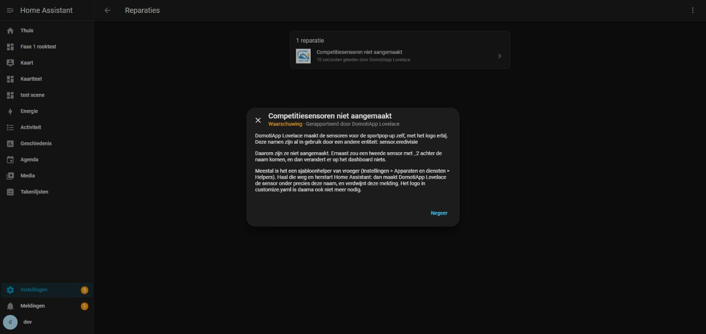
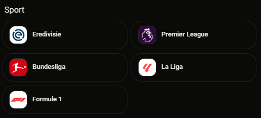

# 0.57.0 — Vijf competitiesensoren met hun logo, uit de integratie zelf

## De vraag

7 oktober 2026, via de beheersessie, op verzoek van de eigenaar. In de pop-up
#sport van het DomotiApp-dashboard staan vijf knoppen, één per competitie, en
elke knop toont het `entity_picture` van een sensor. Die sensoren waren bij
elke klant een sjabloonhelper, met het logo uit `customize.yaml` en het plaatje
met de hand in `/config/www`. De integratie moet ze zelf maken, met het logo
dat ze zelf meelevert.

Twee beslissingen van de eigenaar, gevraagd vóór het bouwen:

| Vraag | Zijn antwoord |
|---|---|
| De logo's zijn merken van derden en de repo is publiek. Meeleveren? | **Wel meeleveren** |
| Krijgt elke installatie de sensoren, of komen ze achter een schakelaar? | **Altijd aan** |

## Hoe ze er bij hem thuis uitzien (alleen gelezen)

```
sensor.eredivisie      'Eredivisie'      friendly_name, entity_picture /local/new_voetbal_eredivisie.png   template, config entry
sensor.premier_league  'Premier League'  ...                                                              template, config entry
sensor.bundesliga      'Bundesliga'      ...                                                              template, config entry
sensor.la_liga         'La Liga'         ...                                                              template, config entry
sensor.formule_1       'Formule 1'       ...                                                              template, config entry
```

En de kaart in zijn pop-up: `custom:domotiapp-entities-card`, één per
competitie, met `show_state: false`. Daar rekent het dashboard op: de
entity_id en het plaatje, verder niets.

## Wat er veranderd is

**De logo's** staan naast de achtergrond uit 0.56.0, op vaste adressen:

| Bestand | Uit | Maat |
|---|---|---|
| `/domotiapp_lovelace/afbeeldingen/eredivisie.png` | `new_voetbal_eredivisie.png` | 500x500, 32.072 bytes |
| `/domotiapp_lovelace/afbeeldingen/premierleague.png` | `new_voetbal_premierleague.png` | 500x500, 87.396 bytes |
| `/domotiapp_lovelace/afbeeldingen/bundesliga.png` | `new_voetbal_bundesliga.png` | 500x500, 14.180 bytes |
| `/domotiapp_lovelace/afbeeldingen/laliga.png` | `new_voetbal_laliga.png` | 500x500, 10.223 bytes |
| `/domotiapp_lovelace/afbeeldingen/formule1.png` | `new_formule1.png` | 600x600, 2.946 bytes |

Byte voor byte de bestanden uit de beheermap; geen tekst in de metadata.

**De sensoren** staan in het nieuwe `sensor.py`, het eerste platform van deze
integratie:

| entity_id | Toestand | unique_id |
|---|---|---|
| `sensor.eredivisie` | Eredivisie | `domotiapp_lovelace_competitie_eredivisie` |
| `sensor.premier_league` | Premier League | `domotiapp_lovelace_competitie_premier_league` |
| `sensor.bundesliga` | Bundesliga | `domotiapp_lovelace_competitie_bundesliga` |
| `sensor.la_liga` | La Liga | `domotiapp_lovelace_competitie_la_liga` |
| `sensor.formule_1` | Formule 1 | `domotiapp_lovelace_competitie_formule_1` |

Elk met `friendly_name` gelijk aan de toestand en `entity_picture` op het logo.
Geen apparaat, niet gepold.

**Bezet is bezet.** Bij de installaties die er al waren staan deze namen als
sjabloonhelper. Een tweede sensor zou dan `sensor.eredivisie_2` worden: dubbel,
en op het dashboard verandert er niets. Daarom kijkt de integratie bij het
opstarten per sensor:

1. staat onze unique_id al in het register (ook onder een andere naam, omdat
   iemand hem hernoemde)? Dan is dat hij, en komt er geen tweede bij;
2. anders: is de naam bezet in het register of in de toestanden? Dan wordt hij
   **niet** gemaakt, en komt er een waarschuwing in het log en één melding
   onder Reparaties (`competities_bezet`) met de namen die in de weg zitten;
3. anders: aanmaken, onder precies die naam.

Haalt iemand de helper weg en herstart (of herlaadt) de integratie, dan komt de
sensor alsnog en verdwijnt de melding. Weghalen doen we zelf niet: het is de
configuratie van de klant, en dus werk voor een beheersessie.

`async_unload_entry` meldt het platform weer af vóór de rest van het opruimen.

## Bewijs

### De nieuwe toetsen falen op de oude code

`tests/test_competities.py` en de aangevulde `tests/test_afbeeldingen.py` tegen
0.56.0:

```
PASSED tests/test_afbeeldingen.py::test_het_adres_staat_vast
PASSED tests/test_afbeeldingen.py::test_de_afbeelding_is_meegeleverd[achtergrond.png]
PASSED tests/test_afbeeldingen.py::test_de_afbeelding_wordt_geserveerd[achtergrond.png]
PASSED tests/test_afbeeldingen.py::test_geen_maand_in_de_browsercache
PASSED tests/test_afbeeldingen.py::test_regressiewacht_de_map_toont_geen_inhoud
PASSED tests/test_afbeeldingen.py::test_regressiewacht_niet_buiten_de_map
FAILED tests/test_competities.py::test_de_sensor_staat_er_zoals_het_dashboard_hem_kent[sensor.eredivisie]
FAILED tests/test_competities.py::test_de_sensor_staat_er_zoals_het_dashboard_hem_kent[sensor.premier_league]
FAILED tests/test_competities.py::test_de_sensor_staat_er_zoals_het_dashboard_hem_kent[sensor.bundesliga]
FAILED tests/test_competities.py::test_de_sensor_staat_er_zoals_het_dashboard_hem_kent[sensor.la_liga]
FAILED tests/test_competities.py::test_de_sensor_staat_er_zoals_het_dashboard_hem_kent[sensor.formule_1]
FAILED tests/test_competities.py::test_een_vaste_unique_id_per_sensor - Asser...
FAILED tests/test_competities.py::test_hernoemd_blijft_hernoemd - KeyError: '...
FAILED tests/test_competities.py::test_bezet_is_bezet_en_wordt_gemeld - Asser...
FAILED tests/test_competities.py::test_vrij_gemaakt_komt_hij_alsnog - Asserti...
FAILED tests/test_afbeeldingen.py::test_de_afbeelding_is_meegeleverd[eredivisie.png]
  ... (en de andere vier logo's)
FAILED tests/test_afbeeldingen.py::test_de_afbeelding_wordt_geserveerd[eredivisie.png]
  ... (en de andere vier logo's)
19 failed, 6 passed in 6.66s
```

De zes die slagen zijn de toetsen van de achtergrond uit 0.56.0: hier
REGRESSIEWACHT. Alle negentien nieuwe zijn **NIEUW GEDRAG**. Op de nieuwe code:
25 van 25 groen.

| Toets | Wat hij vastlegt |
|---|---|
| de sensor staat er zoals het dashboard hem kent (5x) | toestand, naam en plaatje zoals bij hem thuis, en het plaatje bestaat |
| een vaste unique_id per sensor | de vijf unique_id's letterlijk |
| hernoemd blijft hernoemd | na hernoemen en herladen geen tweede `sensor.eredivisie` |
| bezet is bezet en wordt gemeld | een `template`-helper op twee namen: die twee niet, geen `_2`, de andere drie wel; log en Reparaties noemen beide |
| vrij gemaakt komt hij alsnog | helper weg, herladen: onze sensor onder precies die naam, melding weg |
| de afbeelding is meegeleverd / wordt geserveerd (5x2) | de logo's op hun vaste adres, zonder token, als PNG |

### Op de testinstance, met een echte sjabloonhelper

Precies de situatie bij hem nagebootst: `sensor.eredivisie` aangemaakt als
sjabloonhelper via de config flow van `template` (dezelfde weg als in de GUI),
en daarna de container herstart met de nieuwe code.

Het log:

```
WARNING (MainThread) [custom_components.domotiapp_lovelace.sensor] Niet aangemaakt,
want de naam is al in gebruik: sensor.eredivisie. Meestal is dat een sjabloonhelper
van vroeger. Haal die weg en herstart Home Assistant, dan maakt DomotiApp Lovelace
de sensor zelf, met het logo erbij.
```

De toestanden en het register:

```
sensor.eredivisie      Eredivisie      template            -
sensor.premier_league  Premier League  domotiapp_lovelace  /domotiapp_lovelace/afbeeldingen/premierleague.png
sensor.bundesliga      Bundesliga      domotiapp_lovelace  /domotiapp_lovelace/afbeeldingen/bundesliga.png
sensor.la_liga         La Liga         domotiapp_lovelace  /domotiapp_lovelace/afbeeldingen/laliga.png
sensor.formule_1       Formule 1       domotiapp_lovelace  /domotiapp_lovelace/afbeeldingen/formule1.png
met _2 erachter:       geen
Reparaties:            competities_bezet, waarschuwing, entiteiten: sensor.eredivisie
```

De melding, geopend met een echte klik (`isTrusted: true`):



(De eerste versie van de titel, "...: de naam is al in gebruik", werd in de
dialoog afgekapt. Ingekort en opnieuw gemeten; dit is de korte.)

Daarna de helper weggehaald (de config entry van `template` verwijderd) en
herstart:

```
sensor.eredivisie  Eredivisie  domotiapp_lovelace  domotiapp_lovelace_competitie_eredivisie  /domotiapp_lovelace/afbeeldingen/eredivisie.png
Reparaties: (geen)
```

Bij de tweede proef is hetzelfde gedaan met een HERLADING van de integratie in
plaats van een herstart: ook dan kwam hij, en ging de melding weg.

### In Chrome, zoals in de pop-up #sport

Op de werkbank (`kaart-test/navbalk`) vijf keer de kaart uit zijn pop-up,
letterlijk overgenomen (`domotiapp-entities-card`, `surface: open`,
`show_state: false`, kolombreedte 6). Naar de view gegaan met een echte klik op
het tabblad (`isTrusted: true`):



Wat de kaarten laden:

```
img /domotiapp_lovelace/afbeeldingen/eredivisie.png     500px echt  34x34
img /domotiapp_lovelace/afbeeldingen/premierleague.png  500px echt  34x34
img /domotiapp_lovelace/afbeeldingen/bundesliga.png     500px echt  34x34
img /domotiapp_lovelace/afbeeldingen/laliga.png         500px echt  34x34
img /domotiapp_lovelace/afbeeldingen/formule1.png       600px echt  34x34

opgehaald: premierleague.png 200 87396, laliga.png 200 10223, eredivisie.png 200 32072,
           bundesliga.png 200 14180, formule1.png 200 2946 (en achtergrond.png 200 10642)
```

### Tellingen

- JS: 1342 toetsen, alle groen (geen JS gewijzigd).
- Python: 773 toetsen, alle groen (lokaal in Docker, `python:3.14-slim`).
- `verify`, `check:registratie`, `check:controls`, `check:css`: OK.
- Bundel 898.147 bytes.

## Samenvatting

De integratie maakt nu zelf `sensor.eredivisie`, `sensor.premier_league`,
`sensor.bundesliga`, `sensor.la_liga` en `sensor.formule_1`, met het logo dat
ze zelf meelevert. Een klant heeft daarvoor geen `customize.yaml` en geen
`/config/www` meer nodig. Waar de naam al bezet is door een oude
sjabloonhelper, maakt de integratie hem niet ernaast, maar zegt ze in het log
en onder Reparaties wat er in de weg zit. Is die helper weg, dan komt de sensor
na een herstart of herlading vanzelf.

## Wat niet lukte

- Niet op zijn eigen installatie bekeken. Daar staan alle vijf de helpers nog,
  dus na de update ziet hij alleen de melding onder Reparaties, en verandert er
  op het dashboard niets. Pas als de helpers weg zijn, komen de sensoren van
  ons. Weghalen is een wijziging bij de klant, en dus werk voor een
  beheersessie, met zijn ja.
- Het testtabblad stond verborgen; de views bouwden traag (valkuil 66). Niet
  op een telefoon bekeken.

## Aannames

- Dat de sensoren geen apparaat nodig hebben. Ze staan onder de integratie in
  de entiteitenlijst; een apparaat "DomotiApp Sport" zou alleen een extra kaart
  in de apparatenlijst geven.
- Dat één melding voor alle bezette namen beter is dan vijf: bij hem zijn het
  er vijf tegelijk, en dan zou Reparaties vijf keer hetzelfde zeggen.
- Dat een naam ook "bezet" is als er alleen een TOESTAND voor bestaat (een
  YAML-sensor zonder unique_id). Bij hem staan ze in het register, dus dat
  geval is daar niet aan de orde, maar een `_2` is daar net zo goed fout.

## git status --porcelain

Vlak voor de commit:

```
 M CLAUDE.md
 M custom_components/domotiapp_lovelace/__init__.py
 M custom_components/domotiapp_lovelace/const.py
 M custom_components/domotiapp_lovelace/frontend/domotiapp-lovelace.js
 M custom_components/domotiapp_lovelace/manifest.json
 M custom_components/domotiapp_lovelace/strings.json
 M custom_components/domotiapp_lovelace/translations/en.json
 M custom_components/domotiapp_lovelace/translations/nl.json
 M tests/test_afbeeldingen.py
?? custom_components/domotiapp_lovelace/afbeeldingen/bundesliga.png
?? custom_components/domotiapp_lovelace/afbeeldingen/eredivisie.png
?? custom_components/domotiapp_lovelace/afbeeldingen/formule1.png
?? custom_components/domotiapp_lovelace/afbeeldingen/laliga.png
?? custom_components/domotiapp_lovelace/afbeeldingen/premierleague.png
?? custom_components/domotiapp_lovelace/sensor.py
?? docs/competities-en-logos/
?? tests/test_competities.py
```
