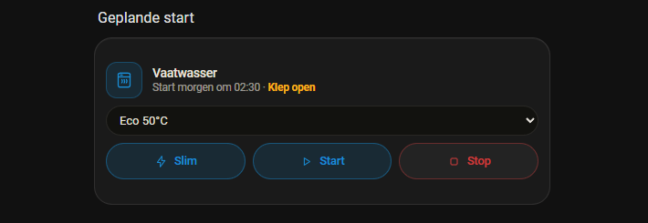

# De geplande start op de vaatwasserkaart

**Ronde van 26 september 2026.** Branch `fase-52/geplande-start`, uitgave 0.47.0.

## Wat er gevraagd is

> "maak bij de vaatwasser kaart in de GUI ook een invulveld om de sensor in te
> vullen die laat zien wanneer de vaatwasser start. Ik heb een EMS systeem die
> hem start en die geeft zijn sensor een tijd weer"

Die sensor is die van DomotiApp Coach:
`sensor.domotiapp_coach_vaatwasser_start_om`, `device_class: timestamp`. Zolang
de coach wacht staat het geplande startmoment erin. Draait de vaatwasser, of is
hij niet vrijgegeven, dan staat de sensor op `unknown`. In het attribuut
`release_switch` staat de vrijgaveschakelaar (thuis is dat
`input_boolean.schakelaar_vaatwasser`).

De aanleiding staat in de kop van `sensor.py` van de coach. Op 26 september werd
de vaatwasser om 12:16 vrijgegeven, de coach plande 14:00, en om 13:12 ging hij
met de hand aan. Op de kaart stond nergens dat er al een plan was.

## Wat de kaart nu doet

| | |
|---|---|
| **Nieuw veld "Geplande start"** | in de editor onder *Resterende tijd*. Kiest een `sensor`, `input_datetime`, `datetime` of `time` |
| **Wat er op de kaart komt** | "Start om 14:00", "Start morgen om 02:30", "Start dinsdag om 14:00" en na een week "Start 5 okt om 14:00" |
| **Leeg laten** | de kaart zoekt zelf de sensor van de coach, via de schakelaar die al bij *Slimme sturing* staat. Daar heeft de coach `release_switch` voor meegegeven |
| **Ingevuld** | het veld gaat altijd voor op wat de kaart zelf vindt |

### Wat er voorgaat

Het plan vervangt "Klaar om te starten" en "Uit", maar het mag niets
verbergen dat belangrijker is:

| toestand van de machine | met een plan | zonder plan (ongewijzigd) |
|---|---|---|
| Klaar / Ready | **Start om 14:00** | Klaar om te starten |
| Uit / Inactive | **Start om 14:00** | Uit |
| Klaar, klep open | **Start om 14:00 · Klep open** | Klep open |
| Uitgestelde start | **Start om 14:00** (i.p.v. de aftelling) | Start over 2 u 30 min |
| Draait | Draait · nog 1 u 24 min | idem |
| Programma klaar | Programma klaar | idem |
| Storing | Storing | idem |
| Niet bereikbaar | Niet bereikbaar | idem |

Een open klep blijft erbij staan, omdat de start op afstand van Home Connect
niet doorgaat met de klep open. Bij "Programma klaar" en "Niet bereikbaar"
blijft de melding van de machine staan: dan is de vaat schoon of is de machine
weg, en dat moet je zien.

### De tekst gaat vanzelf mee met de klok

Het moment zelf verandert niet, maar de woorden wel. Om middernacht wordt
"morgen om 02:30" gewoon "om 02:30". En na het moment hoort de tekst weg te gaan
als de machine niet is gaan draaien. De kaart tekent zichzelf daarom op die twee
momenten opnieuw, ook als er in Home Assistant niets verandert (`planTik_`).
Het plan telt nog tot één minuut na het moment. Zo springt de tekst niet weg in
de paar seconden tussen het startsein en de statussensor die "draait" meldt.

Een losse klok als "02:00" betekent vandaag, of morgen als dat tijdstip al
voorbij is. Een nachtelijke start wordt immers 's avonds gepland.

---

## Het bewijs uit de browser

Gemeten op de testinstance (HA 2026.8.1, poort 8127) in een echte browser, met
echte kliks en toetsaanslagen.

### Verse code

```
bundel op schijf       852.057 bytes   sha256 5f622d838828f202...
bundel in de browser   852.057 bytes   sha256 gelijk (na het wissen van service worker en caches)
```

### Het testmateriaal

- `sensor.domotiapp_coach_vaatwasser_start_om`, via `POST /api/states` met
  dezelfde vorm als die van de coach: tijdstip met zone, `device_class:
  timestamp`, en `release_switch: input_boolean.vaatwasser_slim`. Die
  schakelaar staat in het veld Slimme sturing van de testkaart.
- `input_datetime.vaatwasser_geplande_start` (nieuw, datum en tijd), gezet op
  27-09-2026 02:30.

### Leeg veld: de kaart vindt de coachsensor zelf

De kaart in de view, zonder `planned_start` in de config:

```
status   "Start om 23:11"      (de coachsensor stond op 23:11)
tone     var(--dac-accent-hi)
hoogte   184                    (drie rasterrijen, ongewijzigd)
```

### Het veld in de editor, met echte kliks en een spatie

De editor is geopend met het potlood in de overlay van de kaart. Daarna is er
in het veld *Geplande start* geklikt en "geplande start" getypt, met een spatie
erin. Alles uit een capture-luisteraar op `window`:

```
click    isTrusted=true  (661,697)  span.placeholder  <- md-item        het veld Geplande start
keydown  isTrusted=true  g e p l a n d e                <- ha-input-search
keydown  isTrusted=true  SPATIE  input.control          <- wa-input <- ha-input-search
keydown  isTrusted=true  s t a r t
click    isTrusted=true  (607,370)  span                <- md-item        "Vaatwasser geplande start"
click    isTrusted=true  slot.label <- button <- ha-button <- footer     Opslaan
```

Het voorbeeld in de editor sprong daarbij van "Start om 23:11" (de coachsensor)
naar **"Start morgen om 02:30"** (de helper). Het veld gaat dus voor. In de
opgeslagen config staat het op het hoogste niveau, en er is geen genest blok
(valkuil 33):

```yaml
planned_start: input_datetime.vaatwasser_geplande_start
```

```
Object.keys(config).filter(k => typeof config[k] === "object")  ->  []
```

### De volgorde, op de echte kaart in de view

De toestanden zijn in de testinstance omgezet, en daarna is de kaart uitgelezen:

```
Ready, klep dicht, veld = 02:30  -> "Start morgen om 02:30"              accent  184
Ready, klep OPEN                 -> "Start morgen om 02:30 · Klep open"  accent  184
Inactive, klep open              -> "Start morgen om 02:30 · Klep open"  accent  184
Run                              -> "Draait · nog 1 u 24 min"            accent  184
Finished                         -> "Programma klaar"                    good    184
Ready, terug                     -> "Start morgen om 02:30"              accent  184
```

De hoogte blijft in elke toestand 184px.



### De tekst vervalt zonder dat er iets verandert

Het veld is weer leeg gemaakt, zodat de kaart op de coachsensor terugvalt. De
sensor is gezet op 21:29:38 en daarna niet meer aangeraakt. Elke tien seconden
is de kaart uitgelezen:

```
21:29:12  "Start om 21:29"        sensor.last_updated=19:28:58 (UTC)
21:29:32  "Start om 21:29"        idem
21:29:42  "Start om 21:29"        idem   <- moment voorbij, maar binnen de minuut marge
21:30:22  "Start om 21:29"        idem
21:30:33  "Start om 21:29"        idem
21:30:43  "Klaar om te starten"   idem   <- de tik van 21:30:39
21:30:53  "Klaar om te starten"   idem
```

De tekst verviel tussen 21:30:33 en 21:30:43. Verwacht was 21:30:39 (het
moment plus 61 seconden). `last_updated` van de sensor bleef al die tijd
gelijk, dus het is de eigen tik van de kaart geweest en geen nieuwe `hass`.
Daarna staat er geen tik meer (`tik_ = null`), want er is niets meer gepland.

---

## Tests

`tests/js/vaatwasser-start.test.mjs`, 21 tests. De module wordt als geheel
geïmporteerd, zodat elke test tegen de oude code op zijn eigen reden valt en
niet het hele bestand op één ontbrekende export.

**Tegen de code van `main`** (`vaatwasser-logica.js` teruggezet, tests gedraaid,
teruggezet):

```
✖ leest het tijdstip van de coach, met zone            TypeError: V.startMoment is not a function
✖ ... (alle 15 tests van startMoment, startTekst en vindStartSensor idem)
✖ NIEUW GEDRAG: zegt wanneer hij start in plaats van klaar om te starten
    + 'Klaar om te starten'
    - 'Start om 14:00'
✖ NIEUW GEDRAG: ook als de machine op uit staat
✖ NIEUW GEDRAG: houdt een open klep erbij, want daarmee gaat het plan mis
✖ NIEUW GEDRAG: een klokmoment gaat voor de aftelling van een uitgestelde start
✔ REGRESSIEWACHT: een draaiende machine draait, plan of geen plan
✔ REGRESSIEWACHT: een afgelopen programma en een storing winnen van het plan
✔ REGRESSIEWACHT: een machine die weg is, is weg
✔ REGRESSIEWACHT: zonder plan verandert er niets
ℹ pass 4
ℹ fail 17
```

De vier die op de oude code slagen zijn als **REGRESSIEWACHT** gelabeld. Ze
toetsen dat een plan NIET wint van iets belangrijkers, en dat deed de oude code
vanzelf.

**Tijdzones.** De tests rekenen in lokale tijd. Ze zijn gedraaid met
`TZ=America/New_York` (GMT-4), `TZ=Asia/Tokyo` (GMT+9) en Europe/Amsterdam
(GMT+2), en zijn in alle drie groen.

**Het geheel:** 1185 JS-tests groen. `npm run verify`, `check:registratie` en
`check:css` zijn ook groen. De Python-kant is niet aangeraakt; die draait in CI.

---

## Samenvatting

- Nieuw veld **Geplande start** in de editor van de vaatwasserkaart. Op de kaart
  staat dan "Start om 14:00", "Start morgen om 02:30" of een dag of datum.
- Leeg laten werkt thuis ook: de kaart vindt de sensor van DomotiApp Coach via
  de schakelaar bij Slimme sturing.
- Het plan verbergt niets: draaien, klaar, storing en niet bereikbaar gaan voor,
  en een open klep blijft erbij staan.
- De tekst loopt mee met de klok, over middernacht en na het moment zelf.

## Wat niet lukte

- **"Niet bereikbaar" met een plan erbij** is niet in de browser nagemeten. Een
  `input_select` kan niet op `unavailable` gezet worden. Het staat wel in een
  unittest (REGRESSIEWACHT).
- **De overgang om middernacht** is niet in de browser afgewacht. Het vervallen
  na het moment zelf is wel gemeten; dat loopt via dezelfde tik.
- De echte coachsensor op de productie-HA is niet gelezen, want daar is niet om
  gevraagd. De vorm komt uit `sensor.py` van de coach en uit de sensor die de
  eigenaar in het gesprek plakte. De notities van de coach zeggen zelf dat hij
  nog niet in een echte HA getest is ("na installeren nakijken of hij
  verschijnt").

- **Tijdens het meten kwamen er toetsaanslagen binnen die niet van mij waren.**
  Het tabblad stond op `hidden`, en Chrome is met `SetForegroundWindow` naar
  voren gehaald. De capture-luisteraar zag daarna `.`, spatie, `Z`, `I`, `e` en
  spatie op `body` binnenkomen voordat ik iets typte. Waarschijnlijk typte de
  eigenaar op dat moment in de terminal. Door de `e` opende Home Assistant zijn
  entiteitenzoeker. Het had geen invloed op de meting: mijn eigen aanslagen
  kwamen daarna, in het veld zelf. Maar wat er in de terminal getypt werd, is
  daar mogelijk niet aangekomen. Staat nu als valkuil 59 in CLAUDE.md.

## Aannames

- Het veld heet in de YAML `planned_start`, in lijn met de Engelse sleutels die
  er al stonden (`remaining`, `progress`, `smart`).
- Leeg laten valt terug op de coachsensor via `release_switch`. Daar is niet
  expliciet om gevraagd, maar de coach heeft dat attribuut juist daarvoor
  meegegeven ("zodat de kaart hem via zijn `smart`-veld kan vinden", notities
  van de coach van 26-09-2026). Wie dat niet wil vult het veld in.
- "Programma klaar" gaat voor het plan. Na een afgelopen programma moet de klep
  eerst open voordat Home Connect weer op afstand kan starten, dus een plan
  naast "klaar" is in de praktijk een oud plan.

## git status --porcelain

Vóór de commit:

```
 M CLAUDE.md
 M custom_components/domotiapp_lovelace/frontend/domotiapp-lovelace.js
 M custom_components/domotiapp_lovelace/manifest.json
 M src/cards/dishwasher-card.js
 M src/cards/vaatwasser-logica.js
?? docs/geplande-start-vaatwasser/
?? tests/js/vaatwasser-start.test.mjs
```

Na de commit leeg.
