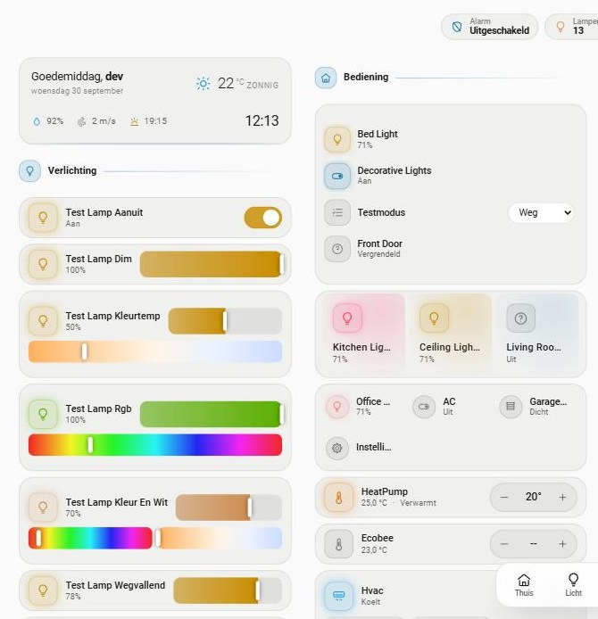

# 0.54.0 — Een licht thema, en de kaart kiest zelf

## De vraag

Op 30 september 2026:

> kan je er ook nog een light theme van maken? Nu hebben we een dark theme. En
> dan als we de integratie toevoegen dat je de optie krijgt of light of dark
> theme of heb je een andere oplossing?

En terwijl het gebouwd werd:

> dus met een witte achtergrond moet alles ook mooi zijn snap je

## Het antwoord in het kort

| | |
|---|---|
| een licht thema | ja, voor alle kaarten, de twee badges en elk scherm dat ze openen |
| de keuze bij het toevoegen | ja: **Automatisch**, **Licht** of **Donker** |
| de andere oplossing | **Automatisch**: de kaart ziet zelf of het dashboard licht of donker is. Dat is de standaard, ook voor wie al geïnstalleerd had |
| achteraf wijzigen | Instellingen → Apparaten & diensten → DomotiApp Lovelace → **Configureren → Uiterlijk** |
| herstart nodig na wijzigen | nee |



## Waarom Automatisch de standaard is

De keuze bij het toevoegen alléén zou betekenen dat je per klant moet onthouden
wat zijn Home Assistant doet, en dat een telefoon die 's avonds naar donker gaat
lichte kaarten houdt. Met Automatisch hoeft er bij de meeste installaties niets
gekozen te worden: de kaart volgt het thema van Home Assistant, en wisselt mee
op het moment dat dat wisselt, zonder de pagina te herladen.

Licht en Donker staan erbij voor het geval dat meten het niet kan weten: een
dashboard met een foto als achtergrond, waar de tekstkleur van het thema niets
zegt over wat er achter de kaart ligt.

## Wat er NIET verandert bij wie al geïnstalleerd had

Een installatie van vóór 0.54.0 heeft de keuze niet en staat daarmee op
Automatisch. Op een donker dashboard blijft alles donker: dat is gemeten met het
thema van de eigenaar zelf (zie *Gemeten* hieronder), en dat thema is precies het
geval waar de voor de hand liggende aanpak de fout in gaat.

Op een LICHT dashboard verandert er wel iets, en dat is de bedoeling: daar
stonden de kaarten tot nu toe met lichte letters op een witte pagina. Hoe dat
eruitzag is tijdens deze ronde gemeten door de keuze op Donker te zetten op een
lichte pagina: de kaartvlakken en de tekst vallen dan vrijwel weg.

## Hoe de kaart weet wat het dashboard is

Niet uit `hass.themes.darkMode`. Home Assistant zet dat op `false` voor elk
gekozen thema zonder `modes:`, ook als dat thema donker is. Het thema van de
eigenaar is er zo een. Gemeten in de testinstance, met zijn themabestand:

```
thema KOPO   darkMode: false   heeft modes: nee   --primary-text-color: #FFF
  meetprop op de kaart: rgb(255, 255, 255)   ->   36 van 36 kaarten "donker"
```

Wat wel klopt is de tekstkleur van het thema: is die licht, dan is de ondergrond
donker. De kaart leest die kleur via een echte CSS-kleureigenschap
(`column-rule-color`), zodat de browser het omrekenen doet: in de variabele kan
`white`, een `var()` of een `color-mix()` staan, en `getComputedStyle` geeft
altijd `rgb()` terug. `darkMode` is alleen nog het vangnet voor als er niets te
meten valt.

De beslissing staat in `src/thema-logica.js` (zonder DOM, met tests), het meten
en het zetten van het attribuut `dac-thema` in `src/thema.js`.

## Hoe de keuze bij de kaart komt

De keuze staat in de `options` van de config entry en reist mee in het antwoord
van de lader, het scriptje dat Home Assistant op elke pagina als eerste ophaalt:

```
globalThis.__domotiappLovelaceThema="licht";
import("/domotiapp_lovelace/domotiapp-lovelace.js?v=f22cf9ff7380");
```

De globale staat vóór de import, dus de kaarten weten het al bij hun eerste
tekenbeurt: geen donkere flits op een licht dashboard. Een WebSocket-commando is
daarvoor te laat (valkuil 28).

Een wijziging komt zonder herstart en zonder herladen aan. De integratie herlaadt
niet; alleen de lader geeft een andere waarde. De kaarten halen de lader zelf
opnieuw op: als er een kaart in beeld komt (hoogstens eens per vijf seconden),
als de pagina zichtbaar wordt, en elke vijf minuten voor een wandtablet.

## Het lichte thema zelf

Geen omgekeerd donker. Een donkere kaart zet zich af door lichter te zijn dan
zijn ondergrond; een lichte door een tikje donkerder te zijn: zachtgrijs op wit,
met een haarlijn, en alles wat erin ligt stapelt daar een tint bovenop.

Wat er tussen de twee omkeert stond tot nu toe los in de kaarten, als "wit op
vijf procent". Dat staat nu als token in `src/theme.js`, met in donker precies
de waarde die er stond:

| token | donker | licht | waarvoor |
|---|---|---|---|
| `--dac-tint` | `255, 255, 255` | `20, 20, 10` | elk vlak dat zich met een tint afzet |
| `--dac-scheme` | `dark` | `light` | wat de browser tekent: keuzelijsten, tijdvelden |
| `--dac-on-accent-hi` | `#0c0c0a` | `#ffffff` | tekst op een accentvlak |
| `--dac-scrim` | zwart 58% | inkt 34% | het waas achter een scherm |
| `--dac-diepte` | `1` | `0.3` | de slagschaduw onder iets zwevends |
| `--dac-knob`, `--dac-spoor-*` | inkt op een getint spoor | witte knop op een gekleurd spoor | de schuifschakelaar |
| `--dac-veld` | `#1b1b19` | `#ffffff` | de dichte velden van de wekker |

Accent, status en lampgeel zijn in licht donkerder dan in donker, want op wit
zijn de kleuren die op donker het best lezen de slechtste. Uitgerekend tegen het
lichte kaartvlak op een witte pagina (WCAG-contrast):

| kleur | donker, op de donkere kaart | licht, op de lichte kaart |
|---|---|---|
| inkt | 13,6 | 15,9 |
| inkt 2 | 6,0 | 5,8 |
| inkt 3 | 3,1 | 3,3 |
| accent (helder) | 4,9 | 4,8 |
| goed | 5,1 | 4,4 |
| let op | 9,4 | 3,6 |
| kritiek | 3,6 | 5,0 |
| lampgeel | 10,6 | 2,6 |

Het lampgeel haalt de 3:1 met opzet niet: geel dat dat op wit wel haalt is bruin.
Het staat nooit alleen (de chip draagt dezelfde kleur als vulling en rand, de
naam en de stand staan ernaast in inkt).

**De zes identiteitskleuren zijn niet aangepast.** Die zijn als set doorgezocht
op onderlinge afstand, en die afstand verandert niet van de achtergrond. Twee
ervan halen op de lichte kaart net geen 3:1 (oranje 2,95 en lichtblauw 2,80);
dat staat hier zodat het bekend is, en het is de reden dat ze niet in deze
ronde zijn verlegd: dat vraagt de zoektocht opnieuw.

### Lampen

Een lamp draagt de kleur die hij maakt. Op een lichte kaart werkt dat niet
zonder meer, want de meeste lampen maken iets dat dicht bij wit ligt:

- een lamp die **wit licht** maakt (`color_mode` is `color_temp` of `white`)
  krijgt in licht het lampgeel. Eerst werd die kleur donkerder gemaakt; een lamp
  op halve kleurtemperatuur gaf toen `rgb(186, 149, 105)`, een modderkleurige
  schuif. Gezien op de schermafdruk en daarna veranderd;
- een **gekleurde** lamp houdt zijn tint en wordt donkerder tot hij te zien is
  (geel wordt `rgb(161, 161, 0)`, rood en blauw blijven wat ze zijn).

In donker verandert hier niets aan.

## Wat er geraakt is

| | |
|---|---|
| alle kaarten op `DacCard` en de twee badges | volgen via `base.js`; het infoscherm is uitgezonderd (`volgtThema = false`), dat heeft zijn eigen keuze Uiterlijk |
| scenekaart, wekkerkaart en hun editors (lit) | `MetThema` in `src/scene/vormtaal.js` |
| de schermen aan `document.body` (vraag, mediazoeken, bronnen, speakers, sleeptimer, opslag van de camera, meldingen) | meten bij elke opening |
| de icoon-, kleur- en fotokiezer in de editor | volgen het thema van Home Assistant, niet onze keuze: ze staan in zijn dialoog |
| `config_flow.py` | de keuze bij het toevoegen; Configureren begint met een menu |
| `loader.py`, `__init__.py` | de keuze in de lader, en een luisteraar die hem bijwerkt zonder herladen |
| `scripts/check-css.mjs` | bewaker 5: geen wit-met-alfa en geen vast `color-scheme` meer in een kaart |

## Afwijking van SPEC.md

`SPEC.md` beschrijft in 15.2 een options flow die meteen met de keuzelijst van
het opruimoverzicht begint en afsluit met `async_create_entry(title="",
data={})`, en in 19 een config flow die "bewust leeg" is. De opdracht vraagt om
een keuze bij het toevoegen, en daarmee wijkt dit af:

- de config flow heeft één veld;
- Configureren begint met een menu (*Uiterlijk* / *Opgeslagen scenes opruimen*);
  de opruimstappen zelf zijn ongewijzigd, de eerste heet `scenes` in plaats van
  `init`;
- de opruimstap sluit af met de bestaande options in plaats van `{}`. Dat moest:
  `async_create_entry` van een options flow vervangt de options, en `{}` zou de
  themakeuze wissen bij elke kamer die wordt opgeruimd.

`SPEC.md` is NIET aangepast. Een menu vóór het opruimoverzicht stond er in 0.5.0
ook al (de stap Alarmcode). Wil de eigenaar dat de SPEC dit beschrijft, dan is
dat een aparte wijziging op zijn verzoek.

## Bewijs

### De tests falen op de code van vóór deze ronde

`tests/js/thema-contrast.test.mjs` op `main`:

```
SyntaxError: The requested module '../../src/theme.js' does not provide an export named 'lichtTokens'
ℹ pass 0
ℹ fail 1
```

`tests/js/thema-logica.test.mjs` op `main`, met alleen de nieuwe rekenmodule
ernaast gelegd (zonder die module is het een importfout en zegt het niets):

```
✖ lightTone: op een lichte kaart valt een witte lamp terug op het lampgeel
    actual: 'rgb(255,244,229)',
    expected: null,
✖ lampKleur van de badge: hetzelfde, voor het gemiddelde van de lampen
    actual: 'rgb(255,247,235)',
    expected: null,
ℹ tests 27
ℹ pass 25
ℹ fail 2
```

`tests/test_thema.py` op `main`:

```
ImportError: cannot import name 'CONF_THEMA' from 'custom_components.domotiapp_lovelace.const'
1 error in 0.50s
```

Dat is een importfout en dus een triviale mislukking; de afzonderlijke tests
zijn op de oude code niet aan het woord gekomen.

| Test | Soort |
|---|---|
| `gemetenThema`: lichte tekst is een donker dashboard, en de meting wint van `darkMode` | **NIEUW GEDRAG** |
| `themaVoor`: de instelling wint van de meting; zonder meting blijft het donker | **NIEUW GEDRAG** |
| `instellingUit`: de keuze uit het antwoord van de lader; een oude lader is geen fout | **NIEUW GEDRAG** |
| de hash is nog uit hetzelfde antwoord te lezen (`hashUit`) | **REGRESSIEWACHT** |
| `lampkleurVoor`: wit licht geeft het lampgeel, een kleur wordt donkerder | **NIEUW GEDRAG** |
| `lightTone` en `lampKleur` zonder het nieuwe argument ongewijzigd | **REGRESSIEWACHT** |
| de lichte tokens halen hun contrast tegen het lichte kaartvlak | **NIEUW GEDRAG** |
| elke lichte token bestaat ook in donker | **NIEUW GEDRAG** |
| in donker is geen tokenwaarde verschoven (22 waarden) | **REGRESSIEWACHT** |
| toevoegen vraagt om het thema; de keuze belandt in de options | **NIEUW GEDRAG** |
| Configureren begint met een menu; Uiterlijk toont de huidige keuze | **NIEUW GEDRAG** |
| opruimen laat de themakeuze staan | **NIEUW GEDRAG** |
| de lader zet het thema vóór de import, en volgt de keuze zonder herladen | **NIEUW GEDRAG** |
| de lader laat geen onbekende waarde door (`";alert(1);//`) | **NIEUW GEDRAG** |
| de lader bevat nog steeds precies één hash | **REGRESSIEWACHT** |

Bewaker 5 in `check:css` is aangetoond door in `cover-card.js` één tint terug te
zetten naar `rgba(255,255,255,.14)`: de bewaker viel om met "Een kleur die alleen
in donker klopt verdwijnt in het lichte thema".

### Tellingen

| | |
|---|---|
| JS-tests | 1322 van 1322 groen (was 1258) |
| Python-tests | 737 van 737 groen (was 726); gedraaid in `python:3.14-slim` |
| `npm run verify` | bundel actueel, 0.54.0, 893.983 bytes |
| `check:registratie`, `check:css`, `check:controls` | groen |

### Gemeten in Chrome, op de testinstance (poort 8127, HA 2026.8)

**Verse code.** Service worker en caches gewist, daarna `fetch(url, {cache:
"reload"})`:

```
schijf    893983 bytes   sha256 4b59b7c063f74d7f7dbf47350fee4df91f6a8375fa07353b67cf9142961f2fa3
browser   893983 bytes   sha256 4b59b7c063f74d7f7dbf47350fee4df91f6a8375fa07353b67cf9142961f2fa3
de module die draait: ?v=4b59b7c063f7, en DacCard.prototype.themaGewisseld_ bestaat
```

Dat is de bundel van vlak vóór het ophogen van het versienummer; daarna is
alleen de versie veranderd (0.54.0, `?v=f22cf9ff7380`), en die is opnieuw
geladen: de console meldt `DOMOTIAPP-LOVELACE 0.54.0` en de view tekent zich.

**Meewisselen met Home Assistant, zonder herladen.** Een view met 36 kaarten,
van elk type minstens één:

```
Home Assistant donker (tekst #e1e1e1)      36 kaarten "donker"
Home Assistant licht  (tekst #141414)      36 kaarten "licht"    meetprop rgb(20, 20, 20)
thema KOPO (darkMode false, tekst #FFF)    36 kaarten "donker"   meetprop rgb(255, 255, 255)
```

**De lichte kaart, gemeten op de verlichtingskaart** (pagina `#fafafa`, kaartvlak
`rgb(240, 240, 240)`):

| | kleur | contrast |
|---|---|---|
| naam | `rgb(26, 26, 23)` | 15,32 |
| stand | `rgba(26, 26, 23, 0.68)` | 5,66 |
| icoon van een brandende lamp | `rgb(201, 141, 0)` | 2,53 |
| `color-scheme` van de kaart | `light` | |

**Een echte klik in het lichte thema.** De schakelaar van *Test Lamp Aanuit*:

```
click   isTrusted: true   button.toggle < span.ctl < div.lamp
light.test_lamp_aanuit: on -> off
knop rgb(255, 255, 255), spoor rgba(20, 20, 10, 0.08), icoon rgba(26, 26, 23, 0.5)
```

**Configureren → Uiterlijk, met echte kliks** (vier, alle vier `isTrusted:
true`: het tandwiel, de menuregel, het keuzerondje Donker, Verzenden):

```
lader vóór:  thema "auto"
lader na:    thema "donker"      zonder herladen van de integratie
daarna, terug naar het dashboard zonder de pagina te herladen: 5 van 5 kaarten "donker"
```

**De integratie toevoegen, met echte kliks** (drie, `isTrusted: true`: OK, het
keuzerondje Licht, Verzenden). De bestaande entry is daarvoor eerst verwijderd:

```
de eerste stap toont: Automatisch (volgt Home Assistant) [gekozen] / Licht / Donker
na Verzenden: entry "loaded", lader thema "licht"
met Home Assistant op donker: 36 van 36 kaarten blijven "licht"
```

Daarna is de keuze teruggezet op Automatisch.

**De schermen in licht**, elk geopend en bekeken op een schermafdruk: het
meldingenscherm, het mediazoekscherm, de sleeptimer, de bevestigingsvraag, de
bronkiezer, het opslagscherm van de camera, de scene-editor, de wekker-editor.
Alle acht dragen `dac-thema="licht"`. De beheerkaart van het infoscherm en de
drie kiezers van de editor zijn met de hand in de pagina gehangen en bekeken.

---

## Samenvatting

Er is een licht thema voor alle kaarten, de badges en de schermen die ze openen.
De keuze staat bij de integratie: Automatisch, Licht of Donker, bij het
toevoegen en daarna onder Configureren → Uiterlijk. Automatisch is de standaard
en leest aan de tekstkleur van het thema van Home Assistant af wat het dashboard
is; de kaarten wisselen mee zonder herladen. Op het donkere thema van de
eigenaar verandert er niets, en dat is gemeten. In donker is geen tokenwaarde
verschoven.

## Wat niet lukte

- **Het testtabblad stond de hele ronde op `hidden`.** De eigenaar werkte in een
  ander venster en het tabblad is niet naar voren gehaald. Schermafdrukken en
  echte kliks werkten, maar er is dus niets gemeten dat zichtbaarheid nodig
  heeft: geen animaties, en de automatische controle "als de pagina zichtbaar
  wordt" is niet in het echt afgegaan. Dat een wijziging aankomt als er een kaart
  in beeld komt is wél gemeten; de ronde van vijf minuten niet.
- **De kaarteditor van Home Assistant is niet geopend** (die laadt in een
  verborgen tabblad niet). De icoon-, kleur- en fotokiezer zijn met de hand in
  de pagina gehangen en volgden daar het thema van Home Assistant; in de echte
  bewerkdialoog is dat niet gezien.
- **Geen telefoon en geen companion-app.** Een telefoon die 's avonds van licht
  naar donker gaat is nagespeeld door Home Assistant in de browser om te zetten.
- **Niet elk onderdeel is in licht bekeken.** Niet gezien: het submenu van de
  navbalk, de filtermenu's en de tijdlijn van de camerakaart met beelden erin,
  de speakerkiezer, de printer met trays, de autokaart met een foto, en een
  entiteitenkaart in de beeldvorm. Die gebruiken dezelfde tokens, maar dat is
  afgeleid en niet gemeten.
- **De lichte kaart op een écht witte pagina (`#ffffff`)** is uitgerekend (de
  contrasttabel) en niet bekeken; de testinstance heeft `#fafafa`.
- **De demopagina voor de website** (`domotiapp-demohuis.html`) is niet opnieuw
  gebouwd en niet getest met deze bundel.

## Aannames

- Dat Automatisch ook voor bestaande installaties de standaard mag zijn. Het
  alternatief was bestaande installaties op Donker vastzetten; dan blijft een
  klant met een licht dashboard onleesbare kaarten houden tot iemand het omzet.
- Dat het infoscherm zijn eigen keuze Uiterlijk houdt en niet meedoet.
- Dat Licht en Donker vastzetten de kaart doorschijnend laat. Op een pagina van
  de andere soort is dat niet te lezen; het is bedoeld voor een dashboard met
  een foto als achtergrond. Wil de eigenaar dat "Licht" ook op een donkere
  pagina een dichte lichte kaart geeft, dan is dat een volgende ronde.
- Dat een lamp die wit licht maakt in het lichte thema het lampgeel krijgt in
  plaats van zijn eigen (warme of koude) wit.
- Dat de zes identiteitskleuren ongemoeid blijven, ook al halen er twee op de
  lichte kaart net geen 3:1.
- Dat de afwijking van SPEC 15.2 en 19 de bedoeling is, omdat de opdracht er
  letterlijk om vraagt; `SPEC.md` zelf is niet aangepast.
- De velden van de wekker-editor en de knop van de schakelaar op de wekkerkaart
  hadden de kaartkleur van het thema van Home Assistant (`#1c1c1c` in het
  standaardthema) en hebben nu een vaste `#1b1b19`. Dat zijn de enige plekken
  waar in donker een kleur een fractie verschilt.

## git status --porcelain

Zie de PR; op het moment van schrijven, vóór de commit:

```
M  CLAUDE.md
M  README.md
M  custom_components/domotiapp_lovelace/__init__.py
M  custom_components/domotiapp_lovelace/config_flow.py
M  custom_components/domotiapp_lovelace/const.py
M  custom_components/domotiapp_lovelace/frontend/domotiapp-lovelace.js
M  custom_components/domotiapp_lovelace/loader.py
M  custom_components/domotiapp_lovelace/manifest.json
M  custom_components/domotiapp_lovelace/strings.json
M  custom_components/domotiapp_lovelace/translations/en.json
M  custom_components/domotiapp_lovelace/translations/nl.json
A  docs/licht-thema/RAPPORT.md
A  docs/licht-thema/licht.jpg
M  scripts/check-css.mjs
M  src/alarm/alarm-card.js
M  src/alarm/editor.js
M  src/badges/badge-logica.js
M  src/badges/template-badge.js
M  src/base.js
M  src/cards/auto-card.js
M  src/cards/camera-archief.js
M  src/cards/camera-card.js
M  src/cards/climate-card.js
M  src/cards/cover-card.js
M  src/cards/dishwasher-card.js
M  src/cards/entities-card.js
M  src/cards/hvac-card.js
M  src/cards/infoscherm-beheer-card.js
M  src/cards/infoscherm-card.js
M  src/cards/light-card.js
M  src/cards/media-card.js
M  src/cards/meldingen-scherm.js
M  src/cards/navbar-card.js
M  src/cards/printer-card.js
M  src/editor/foto-picker.js
M  src/editor/icon-picker.js
M  src/editor/tone-picker.js
M  src/ha.js
M  src/media/bronkiezer.js
M  src/media/sleeptimer.js
M  src/media/spelerkiezer.js
M  src/media/zoekscherm.js
M  src/scene/editor.js
M  src/scene/scene-card.js
M  src/scene/scene-editor.js
M  src/scene/vormtaal.js
M  src/slider.js
A  src/thema-logica.js
A  src/thema.js
M  src/theme.js
M  src/toggle.js
M  src/vraag.js
A  tests/js/thema-contrast.test.mjs
A  tests/js/thema-logica.test.mjs
M  tests/test_options_flow.py
A  tests/test_thema.py
```
