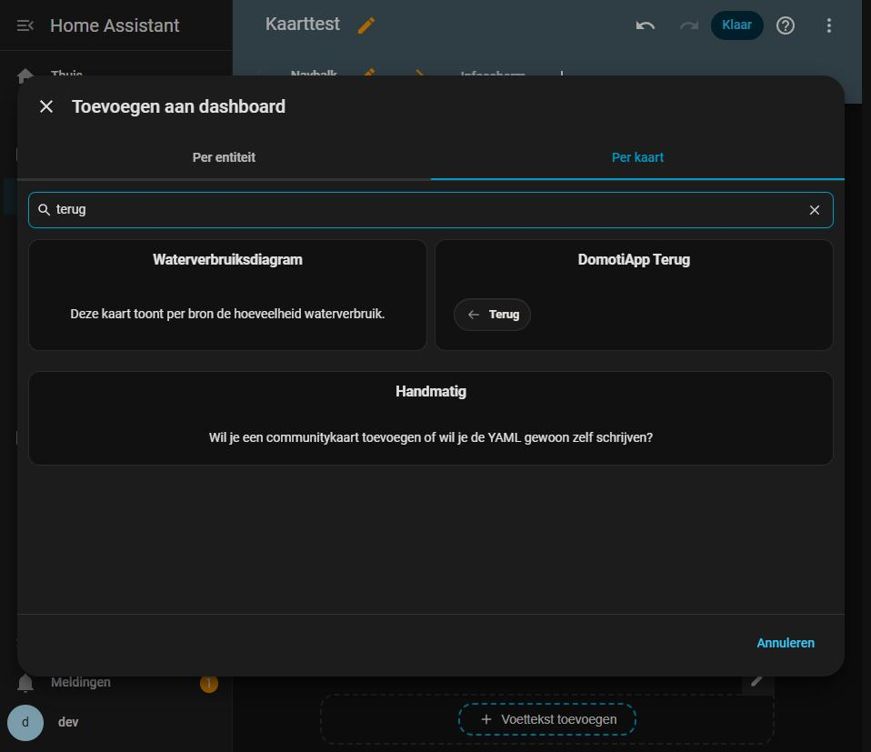

# De terugknop, nu ook als kaart

**Ronde van 17 september 2026.** Branch `fase-51/terug-kaart`, uitgave 0.46.0.

## Wat er gevraagd is

> "Ik zie geen domotiapp terug kaart kan dat kloppen?"

Ja, dat klopte. En het antwoord "hij staat in de badgekiezer" was wel waar maar
niet goed genoeg.

## Wat er misging in de vorige ronde

De vraag van 17 september luidde: *"Ook wil ik net als de mushroom chips card een
terug button die elke keer een stap navigeert naar het home path wat ik kan
opgeven in de GUI."* Daar staat `mushroom-chips-card` in, en dat is een **kaart**.
Er is toen een **badge** van gemaakt.

Dat is meer dan een vindbaarheidskwestie, en dat is de reden dat deze ronde er
is:

| | badge | kaart |
|---|---|---|
| waar hij kan staan | alleen in de KOP van een view | overal in het raster |
| in een bubble-card-pop-up | **niet** | wel |
| welke kiezer | het plusje boven in de view | de gewone kaartkiezer |

De eigenaar bouwt zijn dashboard met pop-ups. Een pop-up heeft geen kop. Precies
de plek waar een terugknop het hardst nodig is, was dus de enige plek waar hij
niet kon staan.

**De badge blijft bestaan.** In de kop van een view is een badge de juiste vorm,
en wie hem daar al heeft staan hoeft niets te veranderen. Ze delen hun gedrag via
`terugDoel()` in `badges/badge-logica.js`, zodat de twee niet uit elkaar kunnen
lopen.

## En waarom hij hem óók in de kaartkiezer niet meteen zal zien

Gemeten in de browser: de kaartkiezer opent op het tabblad **"Per entiteit"**, en
daar staat "terug" niet bij -- deze kaart heeft geen entiteit. Pas op het tabblad
**"Per kaart"** verschijnt hij, en daar staat hij meteen bovenaan op de
zoekterm "terug", met een levend voorbeeld erin.



## Wat de kaart doet

| veld | wat het doet |
|---|---|
| **Waar gaat hij heen** | een pad, bijvoorbeeld `/dashboard/thuis`. Begint het met `#` dan opent hij een pop-up op de huidige view. **Leeg = één stap terug in de geschiedenis** |
| **Tekst ernaast** | leeg is alleen het pijltje |
| **Icoon** | uit onze eigen set (`dai:`) of die van Home Assistant |
| **Uitlijning** | Links, Midden, Rechts -- de kaart zelf is doorzichtig |
| **Achtergrond weglaten** | haalt de pil helemaal weg: geen vulling, geen rand, geen binnenmarge |

De kaart heeft **geen vlak**: de knop is de pil, net als bij een chip. Daarom
haalt "Achtergrond weglaten" hier de pil weg en niet het kaartvlak (dat er niet
is). Dat is dezelfde uitzondering als op de badge.

De breedte is vrij -- `getGridOptions()` geeft met opzet geen `columns` op. Een
terugknop van twaalf kolommen is een halve meter lucht naast een pijltje, en in
een pop-up wil je hem naast iets anders kunnen zetten.

---

## Het bewijs uit de browser

Alles op de testinstance (HA 2026.8.1), in een sections-view van 500px breed.

### De maten vallen op het raster

```
kaart          y=140  h=56     (sectiekop)
kaart          y=204  h=56
kaart          y=268  h=56
kaart          y=332  h=56
kaart          y=396  h=56
kaart          y=460  h=56
kaart          y=524  h=56
```

Zeven kaarten, allemaal **56px** hoog, met **64px** ertussen -- dat is de
rasterrij van Home Assistant (56 + 8) tot op de pixel.

De pil zelf is **36px** hoog, gelijk aan een badge van Home Assistant zelf; met
"Achtergrond weglaten" **30px**, zonder vulling en zonder binnenmarge.

### De uitlijning, gemeten en niet op het oog

De kaart loopt van x=357 tot x=857 (500 breed):

```
links     pil 357..442     linkerrand van de kaart        verschil 0
midden    pil 559..655     midden 607, kaartmidden 607    verschil 0
rechts    pil 765..857     rechterrand van de kaart       verschil 0
kaal      pil 357..410     geen binnenmarge, dus op 357
```

### Allebei de manieren van teruggaan, met een echte klik

**Pad ingevuld** -- klik op "Naar home":

```
isTrusted  true
pad        span.tekst -> button.chip -> div.houder
van        /kaart-test/navbalk
naar       /kaart-test/home
```

Geen paginalading: de luisteraar die vóór de klik was opgehangen stond er daarna
nog, en `history.length` liep op van 3 naar 4. Het is dus een navigatie binnen de
app, precies zoals Home Assistant zelf van view wisselt.

**Pad leeg** -- klik op de knop zonder tekst:

```
isTrusted  true
pad        path -> svg -> span.ico
van        /kaart-test/navbalk
naar       /kaart-test/infoscherm   (de vorige plek in de geschiedenis)
```

### De editor, met echte toetsaanslagen

Getypt in *Waar gaat hij heen*: `/dashboard/mijn huis` -- **met een spatie erin**,
want dat is het veld dat een fase lang geen spatie accepteerde (zie CLAUDE.md).

```
aanslagen        20
alle isTrusted   true
de spatie        {key: " ", isTrusted: true, doel: "input"}
in de config     path: "/dashboard/mijn huis"
```

De keuzelijst en de schakelaar met een echte klik bediend, en daarna opgeslagen:

```
{"icon":"arrowLeft","align":"rechts","type":"custom:domotiapp-terug-card",
 "label":"Terug","path":"/dashboard/mijn huis","bare":true}

genest: []      <- geen enkele sleutel met een object erin
```

Die laatste regel is valkuil 33: een uitklapblok of een rij met een naam nestelt
zijn waarden, en dan vindt de kaart zijn eigen instellingen niet meer terug. Hier
staat alles plat.

### En hij staat in het juiste register

```
window.customCards    domotiapp-terug-card  -- DomotiApp Terug
window.customBadges   domotiapp-terug-badge -- DomotiApp Terug
```

---

## Wat er misging tijdens het meten

- **Valkuil 40**: het testtabblad stond op `visibilityState: "hidden"`, en dan
  komt er geen enkele klik aan. Deze keer is het wél gelukt om het naar voren te
  halen: de paginatitel op `ZZMCPDOELZZ` zetten, het Chrome-venster met
  `SetForegroundWindow` pakken en dan `^{TAB}` sturen tot de venstertitel
  meeliep. Twee stappen was genoeg.
- **En daar komt een les bij die nog niet in CLAUDE.md stond:**
  `ShowWindow(h, SW_RESTORE)` haalt het venster uit de maximale stand. Het
  venster ging van 1920 naar 958 breed, en de eerste meting daarna klopte niet
  meer met de eerste schermafdruk. Meet `innerWidth` dus opnieuw ná het naar
  voren halen -- dat is precies valkuil 47, maar met een andere oorzaak.
- **Valkuil 14**: de eerste zoektocht naar de kaarten gaf 0, omdat
  `hui-grid-section` zijn kaarten in zijn SHADOW root houdt en niet in zijn
  lichte DOM. Dat las als "de view is leeg" terwijl er zeven kaarten stonden.

## Tests

| | Voor | Na |
|---|---|---|
| JS | 1154 | **1164** |
| Python | 670 | 670 |

`tests/js/terug-logica.test.mjs` (10) -- NIEUW GEDRAG. Op de code van vóór deze
ronde faalt het bestand met:

```
Error [ERR_MODULE_NOT_FOUND]: Cannot find module
'C:\dev\domotiapp-lovelace\src\cards\terug-logica.js'
```

Wat er getoetst wordt zijn de twee dingen die hier STIL fout gaan: een uitlijning
die als lege string terugkomt geeft `justify-content: ` -- een ongeldige
verklaring die de browser zonder een woord negeert en die toevallig hetzelfde
oplevert als links -- en een tooltip die leeg blijft op een knop die alleen een
pijltje is.

## Aannames

Geen aannames gedaan. Eén keuze die het vermelden waard is: het is **één
terugknop per kaart** geworden en niet een chips-kaart met een rij knoppen erin.
Een rij navigatieknoppen naast elkaar kan al met de entiteitenkaart -- een plek
zonder entiteit is daar een navigatieknop. Wat daar niet in zat was de
terug-actie, en dat is wat hier bij komt.

## `git status --porcelain`

Zie de PR-beschrijving.
